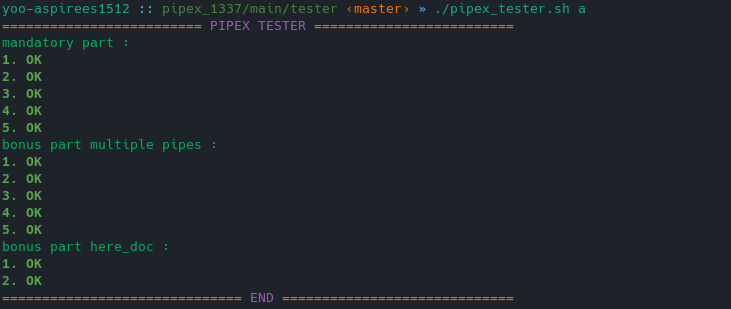

# tester for 42 project 
this tester check if your pipex program work or not. 
>Note that the tester doesn't check the norm or leak memory
## How do i run this tester ?

<pre>git clone git@github.com:Yoo0lh/pipex_tester_42.git  ./pipex_tester.sh [mode]
</pre>
modes :
<pre>
m : mandatory
b : bonus multiple pipes
h : bonus here doc
a : all
</pre>
### example :
this example will run the tester with all parts 
<pre> ./pipex_tester a </pre>

# Contribution
If you noticed something wrong with the code or if you'd like to see a new feature, you can submit an issue. If you'd like to contribute please submit a pull request. 

